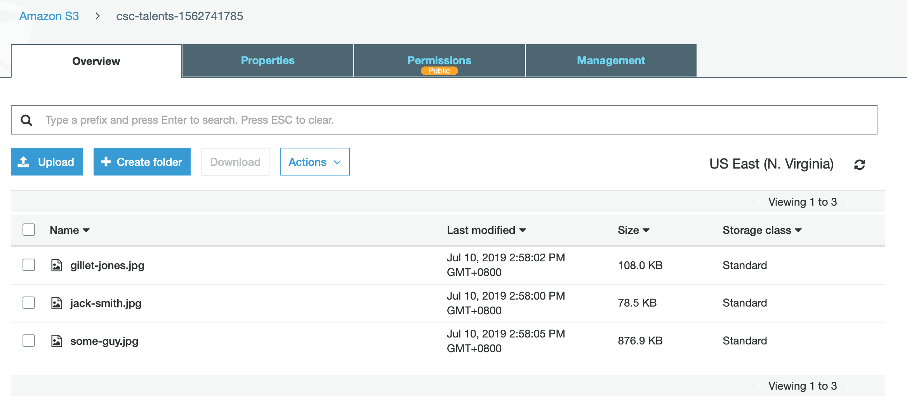
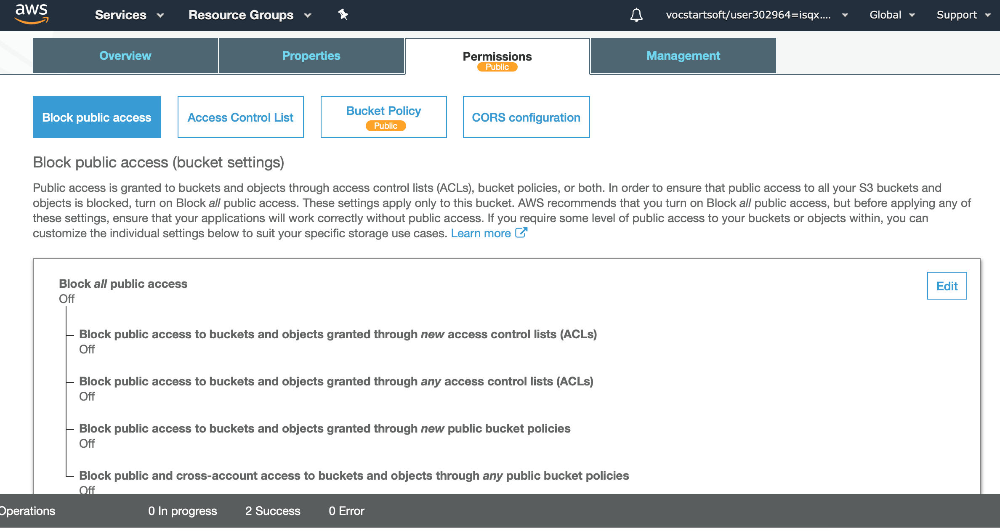
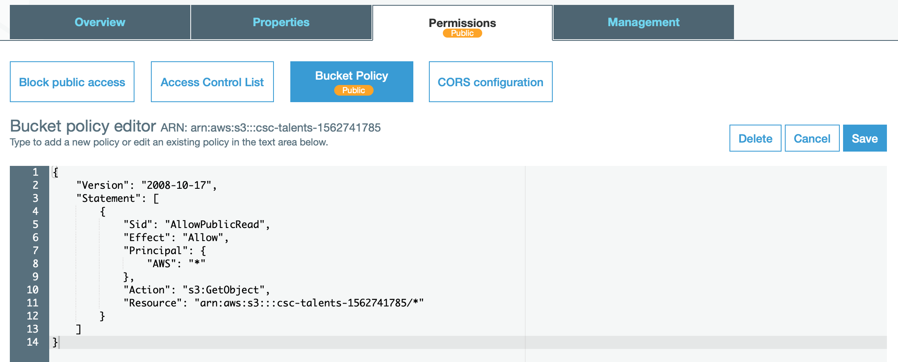
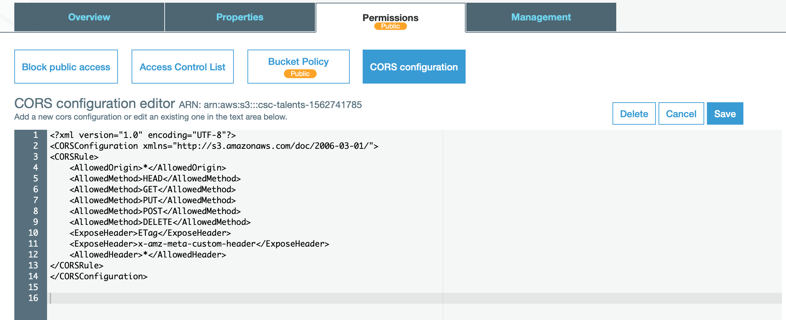
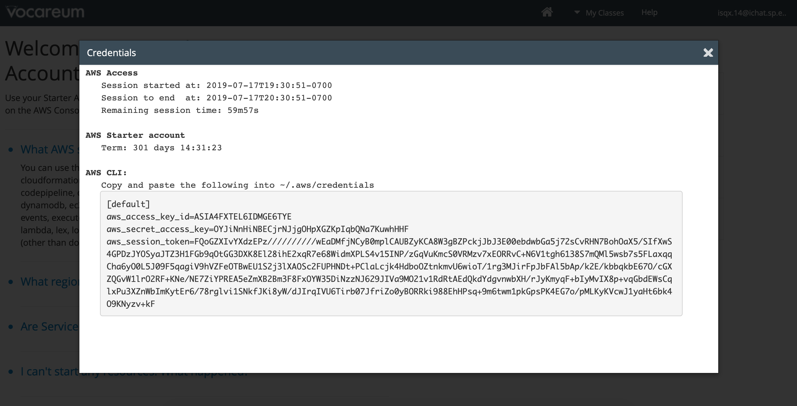

# Example usage of AWS SDK for Browser

## Note

Do not attempt to copy directly, learn from this example and then fix the problems you face in practical 9a.

## Tools Used

-   Vuejs (used in this example but not needed)
-   Buefy (used in this example but not needed)
-   AWS SDK

## Demo

## Setup

-   Create your S3 bucket that will store images
    
-   Turn off 'Block Public Access' so that we can set bucket policy to be public
    
-   Refer to this [link](https://havecamerawilltravel.com/photographer/how-allow-public-access-amazon-bucket/) to set your bucket policy to public. We do this so that the anyone can view the images by a url
    
-   Refer to this [link](https://docs.aws.amazon.com/sdk-for-javascript/v2/developer-guide/cors.html) to configure your CORS for your S3 Bucket. We need this to remove the CORS errors.
    
-   Refer to this [link](https://docs.aws.amazon.com/sdk-for-javascript/v2/developer-guide/s3-examples.html) for AWS example on using AWS SDK for browser. Try to understand the examples given.
-   Get your credentials from Vocareum
    
-   Read the comments in the `index.html`
