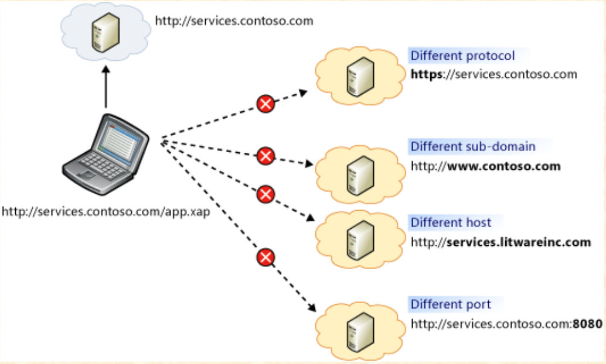

# Topic D - Introduction to Web Service

## Objectives

-   Understanding what a Web Service is
-   What is API
-   Microservice
-   API Gateway
-   CORS
-   SOAP
-   DevOps
-   Questions From Slides

---

## Understanding what a Web Service is

> A Web service is a software system designed to support interoperable machine-to-machine interaction over a network. It has an interface described in a machine-processable format (specifically WSDL). Other systems interact with the Web service in a manner prescribed by its description using SOAP-messages, typically conveyed using HTTP with an XML serialization in conjunction with other Web-related standards. - [W3C](https://www.w3.org/TR/2004/NOTE-ws-gloss-20040211/#webservice)

The above definition was defined by W3C at 2004. The definition is rather specific to SOAP web services. Thus, taking only the first sentence, the definition would then also apply to REST.

---

## What is API

API - Application Programming Interface

> In computer programming, an application programming interface (API) is a set of subroutine definitions, communication protocols, and tools for building software. In general terms, it is a set of clearly defined methods of communication among various components.
>
> ...
>
> An API may be for a web-based system, operating system, database system, computer hardware, or software library. - [Wikipedia](https://en.wikipedia.org/wiki/Application_programming_interface)

### How aspnet pipeline works

https://www.asp.net/media/4071077/aspnet-web-api-poster.pdf

A video on asp.net core pipeline

---

## Microservice

> Microservices are an architectural and organizational approach to software development where software is composed of small independent services that communicate over well-defined APIs. These services are owned by small, self-contained teams.
>
> Microservices architectures make applications easier to scale and faster to develop, enabling innovation and accelerating time-to-market for new features. - [AWS](https://aws.amazon.com/microservices/)

### Characteristics of Microservices

#### Autonomous

    Each component service in a microservices architecture can be developed, deployed, operated, and scaled without affecting the functioning of other services. Services do not need to share any of their code or implementation with other services. Any communication between individual components happens via well-defined APIs.

#### Specialized

    Each service is designed for a set of capabilities and focuses on solving a specific problem. If developers contribute more code to a service over time and the service becomes complex, it can be broken into smaller services.

### Benefits of Microservices

#### Agility

    Microservices foster an organization of small, independent teams that take ownership of their services. Teams act within a small and well understood context, and are empowered to work more independently and more quickly. This shortens development cycle times. You benefit significantly from the aggregate throughput of the organization.

#### Flexible Scaling

    Microservices allow each service to be independently scaled to meet demand for the application feature it supports. This enables teams to right-size infrastructure needs, accurately measure the cost of a feature, and maintain availability if a service experiences a spike in demand.

#### Easy Deployment

    Microservices enable continuous integration and continuous delivery, making it easy to try out new ideas and to roll back if something doesn’t work. The low cost of failure enables experimentation, makes it easier to update code, and accelerates time-to-market for new features.

#### Technological Freedom

    Microservices architectures don’t follow a “one size fits all” approach. Teams have the freedom to choose the best tool to solve their specific problems. As a consequence, teams building microservices can choose the best tool for each job.

#### Reusable Code

    Dividing software into small, well-defined modules enables teams to use functions for multiple purposes. A service written for a certain function can be used as a building block for another feature. This allows an application to bootstrap off itself, as developers can create new capabilities without writing code from scratch.

#### Resilience

    Service independence increases an application’s resistance to failure. In a monolithic architecture, if a single component fails, it can cause the entire application to fail. With microservices, applications handle total service failure by degrading functionality and not crashing the entire application.

---

## Api Gateway

https://microservices.io/patterns/apigateway.html

---

### Service Layer

#### Without Service Layer

#### With Service Layer

</img>

[Microsoft Docs Chapter 5: Layered Application Guidelines](<https://docs.microsoft.com/en-us/previous-versions/msp-n-p/ee658109(v=pandp.10)>)

---

## CORS

### Same Origin Policy

### Cross Origin Resource Sharing

[Cross Origin Resource Sharing](https://en.wikipedia.org/wiki/Cross-origin_resource_sharing)

DEMO

---

## SOAP

Nothing here for now

---

## DevOps

> DevOps is the practice of operations and development engineers participating together in the entire service lifecycle, from design through the development process to production support. - (The Agile Admin)[https://theagileadmin.com/what-is-devops/]

> DevOps is a set of practices that automates the processes between software development and IT teams, in order that they can build, test, and release software faster and more reliably. The concept of DevOps is founded on building a culture of collaboration between teams that historically functioned in relative siloes. The promised benefits include increased trust, faster software releases, ability to solve critical issues quickly, and better manage unplanned work. - [Atlassian](https://www.atlassian.com/devops)

> DevOps is the combination of cultural philosophies, practices, and tools that increases an organization’s ability to deliver applications and services at high velocity: evolving and improving products at a faster pace than organizations using traditional software development and infrastructure management processes. This speed enables organizations to better serve their customers and compete more effectively in the market. - [Amazon](https://aws.amazon.com/devops/what-is-devops/)

### Questions from Slides

-   What is Web Service layer for?

    -   The service layer allows external clients and other systems to access the application and make use of its functionality by communicating with the business layer through service interfaces.
    -   This allows the application to better support multiple client types, and promotes re-use and higher level composition of functionality across applications.

-   Why can you access web service through firewall without hindrance?

    -   Web Service uses HTTP or SMTP to transport data from one point to another.
    -   Firewall allows HTTP packet from the Internet to flow freely through their walls.
    -   Web Service allows for request and response to take place over HTTP-Get, HTTP-Post and SOAP.

-   Web Service - Loosely Coupled?
    -   XML Web service-based solution is loosely coupled:
        -   Dynamically reconfigure if the resources becomes unavailable.
        -   Allow failover because the consumers will not have affinity with any particular instance of Web service.
        -   Web services are URL addressable, which provides for loose coupling.
        -   The Web Services Description Language (WSDL), describe the individual Web services that provide a contract that describes the Web service interface.

### Web service Terminologies

-   SOAP - Simple Object Access Protocol
    -   Envelope for SOAP request/response
-   WSDL - Web service Description Language
    -   Interface for SOAP Web Service
-   UDDI - Universal Description, Discovery and Integration
    -   Repository/Yellow pages for Web Services
-   REST - Representational State Transfer
    -   Architectural style of communication to the services
-   HTTP - Hyper Text Transfer Protocol
    -   Stateless protocol and used for transport
